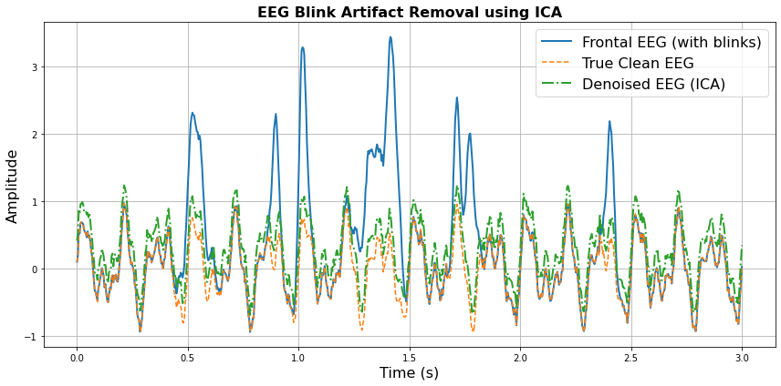

# EEG Blink Artifact Removal using ICA
This repository demonstrates how **Independent Component Analysis (ICA)** can be used to remove **eye blink artifacts** from EEG signals.  
The project simulates EEG data with theta, alpha, and beta rhythms, adds synthetic blink artifacts, and applies **FastICA** to denoise the EEG.

---

## Features
- Simulated EEG with theta (6 Hz), alpha (10 Hz), and beta (20 Hz) rhythms.  
- Randomly generated **blink artifacts** modeled as Gaussian pulses.  
- Multichannel EEG with **different blink weights**.  
- **Independent Component Analysis (FastICA)** to identify and remove blink artifacts.  
- **Evaluation** using Mean Squared Error (MSE) before and after artifact removal.  
- Clear **visualization** of noisy vs clean vs denoised EEG.  

---

## FastICA Mathematics
Independent Component Analysis assumes the observed EEG signals **X** are linear mixtures of unknown independent sources **S**:

$$
X = A \, S
$$

where:
- $X \in \mathbb{R}^{m \times n}$ = observed EEG signals (m channels, n samples)  
- $S \in \mathbb{R}^{k \times n}$ = independent components (sources)  
- $A \in \mathbb{R}^{m \times k}$ = unknown mixing matrix  

---

### Whitening
Before ICA, the signals are centered and whitened so that the covariance is the identity matrix:

$$
Z = V X, \quad \text{with } \mathrm{Cov}(Z) = I
$$

---

### FastICA Fixed-Point Iteration
We maximize **non-Gaussianity** using a contrast function. With nonlinearity $g(u) = \tanh(u)$, the weight vector update is:

$$
w^{\text{new}} = \mathbb{E}[ Z \, g(w^\top Z) ] - \mathbb{E}[ g'(w^\top Z) ] \, w
$$

where:
- $g(u) = \tanh(u)$  
- $g'(u) = 1 - \tanh^2(u)$  

The vector is then normalized:

$$
w^{\text{new}} \leftarrow \frac{w^{\text{new}}}{\| w^{\text{new}} \|}
$$

---

### Reconstructing EEG
Once independent components $S$ are estimated, EEG can be reconstructed as:

$$
\hat{X} = A S
$$

To remove blink artifacts, we set the blink-related component in $S$ to zero before reconstruction.

---

## Results Visualization
  

---

## Author
Sahar Jahani  
[GitHub Profile](https://github.com/Jahani-dev)
